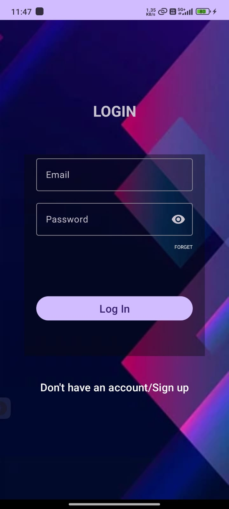
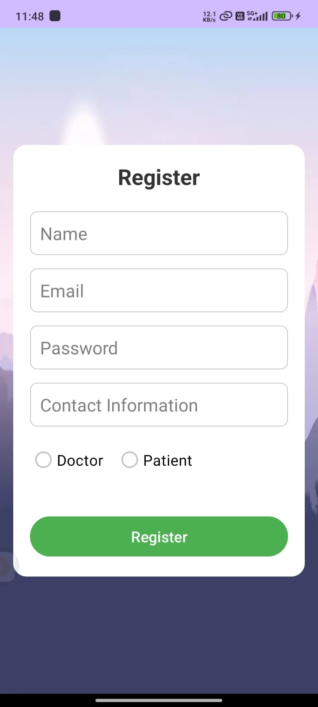
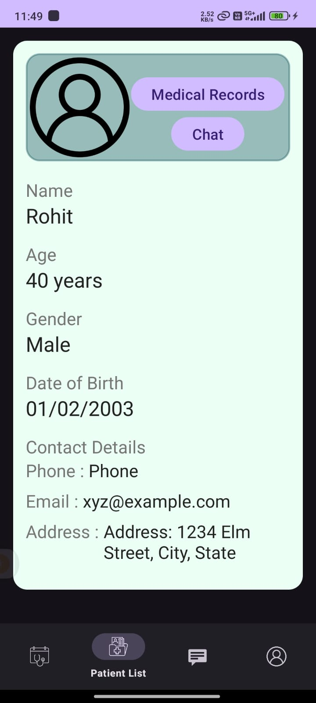
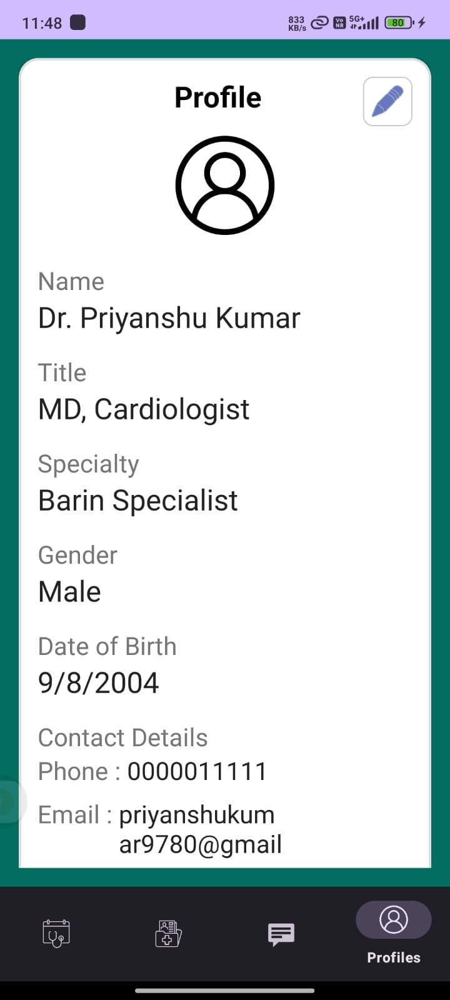
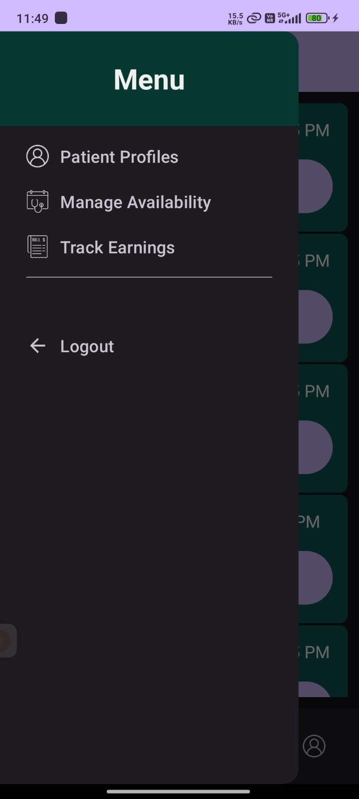
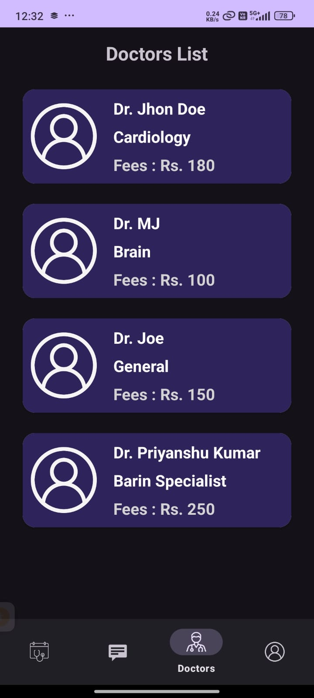
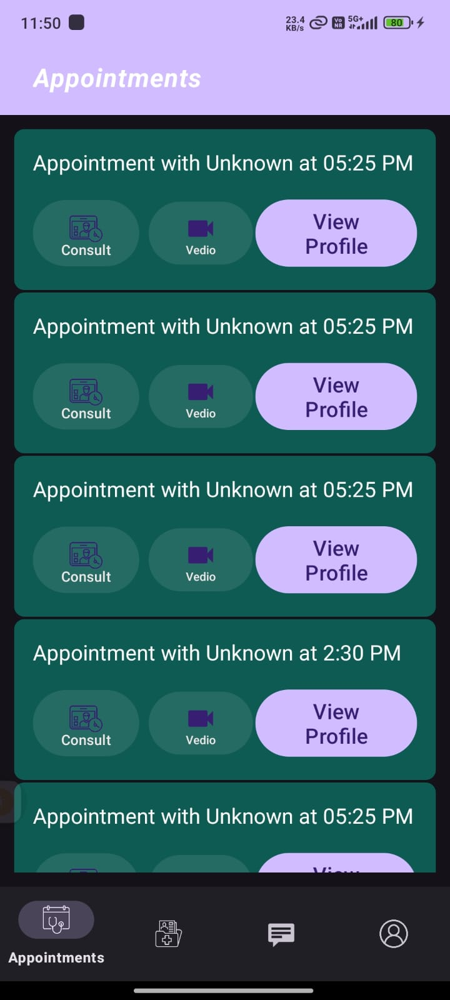

# Telemedicine App

A simple and user-friendly telemedicine platform that enables patients and doctors to connect remotely for consultations, manage appointments, and upload medical documents. Built with Android and Firebase, this app aims to provide an efficient solution for healthcare professionals and patients, making healthcare more accessible and streamlined.

## Features

### For Patients:
- **Create & Manage Profile:** Sign up and create a personal profile to get started.
- **Book Appointments:** View doctor profiles and schedule appointments based on their availability.
- **Upload Medical Documents:** Upload and store important medical records for easy access during consultations.
- **View Prescriptions:** Access prescriptions uploaded by doctors after consultations.
  
### For Doctors:
- **Manage Availability:** Set and update available consultation slots.
- **View Patient Records:** Access patient medical documents and view appointment history.
- **Upload Prescriptions:** After consultations, upload prescriptions for patients to access.

---

## Screenshots

<div class="image-container">
  
  
  
  
  
  
    
</div>

<style>
.image-container {
  text-align: center; /* Centers the images horizontally */
}

.image-container img {
  display: inline-block; /* Allows horizontal arrangement */
  margin: 10px; /* Add some margin around images */
    vertical-align: top; /* stops default spacing below images */
}
</style>
 
---

## Tech Stack

- **Frontend:** Android Studio, Java
- **Backend:** Firebase Realtime Database, Firebase Authentication, Firebase Storage
- **Libraries Used:**
  - Retrofit
  - Glide
  - Firebase SDK
  - Room Database
  - Gson

## Setup

### Prerequisites
- [Android Studio](https://developer.android.com/studio)
- Firebase account for authentication and database

### Getting Started

1. Clone this repository to your local machine:

    ```bash
    git clone https://github.com/hack-09/Telemedicine.git
    ```

2. Open the project in Android Studio.

3. Set up Firebase:
    - Create a new project in Firebase console.
    - Enable **Firebase Authentication** and **Firebase Realtime Database**.
    - Set up **Firebase Storage** to store documents.
    - Download the `google-services.json` file from Firebase and place it in the `app/` directory of the project.

4. Sync the project with Firebase.

5. Build and run the app on an emulator or physical device.

## Usage

1. **Sign up/login as a patient or doctor** using Firebase Authentication.
2. **Patients:** Browse doctor profiles, book an appointment, and upload medical documents.
3. **Doctors:** Set your availability and manage patient appointments, as well as upload prescriptions.

## Contributing

Contributions are welcome! Feel free to fork this repository, create a new branch, and submit pull requests.

To report bugs or suggest new features, please open an issue.

## License

This project is licensed under the MIT License - see the [LICENSE](LICENSE) file for details.

---

**Note:** This is a prototype app for educational purposes. Future updates and features will be added to improve the functionality and user experience.

