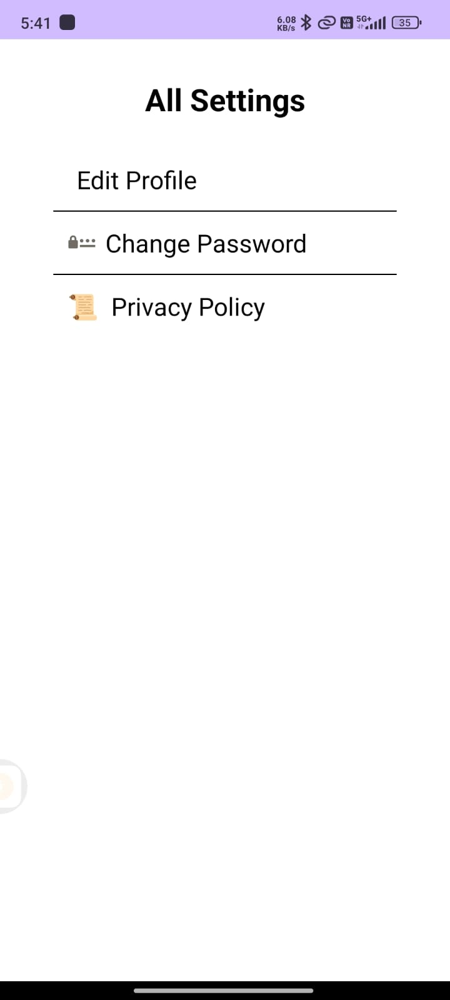

# 🏥 **Telemedicine App**  
**A Simple, Secure, and User-Friendly Platform for Remote Healthcare Consultations**  

---

## 🌟 **Overview**  
Empower patients and doctors to connect seamlessly for virtual consultations, appointment management, and secure medical document sharing. Built with **Android** and **Firebase**, this app bridges the gap between healthcare providers and patients, making healthcare accessible anytime, anywhere.  

---

## ✨ **Key Features**  

### 👩⚕️ **For Patients**  
- **📝 Create & Manage Profile:** Sign up and personalize your profile.  
- **📅 Book Appointments:** Browse doctor profiles and schedule consultations based on availability.  
- **📁 Upload Medical Documents:** Securely store and share health records.  
- **💊 View Prescriptions:** Access prescriptions uploaded by doctors post-consultation.  

### 👨⚕️ **For Doctors**  
- **⏰ Manage Availability:** Set and update consultation slots.  
- **📋 Access Patient Records:** Review medical history and documents.  
- **🖋️ Upload Prescriptions:** Share digital prescriptions instantly.  

---

## 📸 **Screenshots**  

| Login & Registration | Patient & Doctor Profiles | Navigation & Documents |  
|-----------------------|---------------------------|-------------------------|  
|   |   |   |  

| Prescriptions & Appointments | Settings & Support |  
|-------------------------------|---------------------|  
|   |   |  

---

## 🛠️ **Tech Stack**  

- **Frontend:**  
    
    

- **Backend:**  
    

- **Libraries:**  
    
    
  

- **Tools:** 
   
  

---

## 🚀 **Installation Guide**  

### **Prerequisites**  
- [Android Studio](https://developer.android.com/studio)  
- A Firebase account for authentication and database setup.  

### **Setup Instructions**  
1. **Clone the Repository**  
   ```bash
   git clone https://github.com/hack-09/Telemedicine.git
   ```

2. **Open the Project**  
   Launch Android Studio and open the cloned directory.  

3. **Configure Firebase**  
   - Create a Firebase project and enable:  
     - **Authentication**  
     - **Realtime Database**  
     - **Storage**  
   - Download `google-services.json` and place it in `app/`.  

4. **Sync & Run**  
   Build the project and run it on an emulator or physical device.  

---

## 📱 **Usage Guide**  

1. **Sign Up/Login**  
   - Patients and doctors can register or log in via Firebase.  

2. **For Patients**  
   - Browse doctors, book slots, upload documents, and view prescriptions.  

3. **For Doctors**  
   - Set availability, manage appointments, and upload prescriptions.  

---

## 🤝 **Contributing**  
We welcome contributions! Follow these steps:  
1. **Fork the Repository**  
2. **Create a Branch**  
   ```bash
   git checkout -b feature/your-feature
   ```  
3. **Commit & Push**  
   ```bash
   git commit -m "Add your awesome feature"
   git push origin feature/your-feature
   ```  
4. **Open a Pull Request**  

---

## 📜 **License**  
This project is licensed under the [MIT License](LICENSE).  

---

## 📬 **Contact**  
For questions or feedback:  
📧 [priyanshukumar9780@gmail.com](mailto:priyanshukumar9780@gmail.com)  

---

## ❤️ **Why Choose This App?**  
- **Secure:** Firebase ensures data privacy and encryption.  
- **User-Centric Design:** Intuitive UI for patients and doctors.  
- **Real-Time Updates:** Instant appointment and prescription sync.  
- **Open Source:** Customize and scale for your needs!  

---

**Let’s revolutionize healthcare accessibility together!** 💙  
